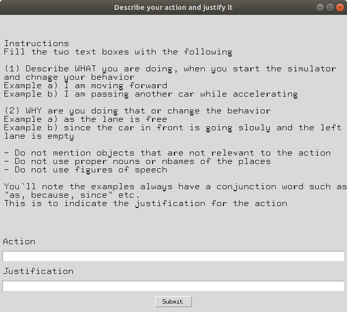

# Data Collection for Evaluating Explanation Quality
This repository is to collect data for evaluating explanation quality in CARLA 0.9.10. 
## Installation
### Install Dependencies
Before setting up CARLA, clone this repository and install the dependencies with the following command:
```
wget https://repo.anaconda.com/miniconda/Miniconda3-latest-Linux-x86_64.sh
bash Miniconda3-latest-Linux-x86_64.sh
conda create -n carla python=3.7
conda activate carla
pip install -r requirements.txt
```
### Install CARLA
You can find CARLA 0.9.10 in this [link](https://github.com/carla-simulator/carla/releases/tag/0.9.10). Please following these steps to install CARLA simulator.
1. Make directory you want to install CARLA. Here, we use ~/carla.
2. Download and unzip CARLA_0.9.10.tar.gz into ~/carla you want to unizp.
3. Download AdditionalMaps_0.9.10.tar.gz but do not unzip this file but place this file in ~/carla/Import.
4. Move to ~/carla and run ./ImportAssets.sh. 
5. Move to ~/carla/PythonAPI/carla/dist and install CARLA python package with following command:
    ```
    easy_install carla-0.9.10-py3.7-linux-x86_64.egg
    ```
## Running the Simulator
1. Add environment variables and Python paths These are necessary for the system to find CARLA, and add the PythonAPI to the Python path.
    ```
    # ${CARLA_ROOT} is the CARLA installation directory
    # ${SCENARIO_RUNNER} is the ScenarioRunner installation directory
    # <VERSION> is the correct string for the Python version being used
    # In a build from source, the .egg files may be in: ${CARLA_ROOT}/PythonAPI/dist/ instead of ${CARLA_ROOT}/PythonAPI
    
    export CARLA_ROOT=/path/to/your/carla/installation
    export SCENARIO_RUNNER_ROOT=/path/to/your/scenario/runner/installation
    export PYTHONPATH=$PYTHONPATH:${CARLA_ROOT}/PythonAPI/carla/dist/carla-<VERSION>.egg
    export PYTHONPATH=$PYTHONPATH:${CARLA_ROOT}/PythonAPI/carla/agents
    export PYTHONPATH=$PYTHONPATH:${CARLA_ROOT}/PythonAPI/carla
    export PYTHONPATH=$PYTHONPATH:${CARLA_ROOT}/PythonAPI
    ```
1. Run following command to run carla simualtr which locates in ~/carla
    ```
    ./CarlaUE4.sh -quality-level=Epic -world-port=2000 -resx=800 -resy=600 -opengl
    ```
2. Run scenario runner in scenario_runner directory in this git repository. In this project, we will only use Scenarion 02 and Scenarion 05 in this [documents](https://github.com/SuhongMoon/scenario_runner/blob/8ae1fb905c296456e949de42c6978b5014f18538/Docs/list_of_scenarios.md). To run the Scenario 02, 
    ```
    python scenario_runner/scenario_runner.py --scenario FollowLeadingVehicleWithObstacle_1
    ```
    and to run the Scenario 05,
    ```
    python scenario_runner/scenario_runner.py --scenario OtherLeadingVehicle_4
    ```
3. Run following command to run manual controller when driving car aggressively:
    ```
    ./manual_control_image_augmentation.py --style aggressive 
    ```
    Otherwise, run following command:
    ```
    ./manual_control_image_augmentation.py --style cautious
    ```
    
4. If you press R after running manual controller, it starts to record your play. 
5. When you playing with this controller, please explain your behavior by yourself by pressing P. If you press P while running the controller, the popup window that you can input your explanation and action appears and the simulator pauses until you submit your explanation.

    

    So you must press P when you first start the controller and when you change your behavior.

6. After running the controller 5 minutes ~ 10 minutes for each driving styles, send me (suhong.moon@berkeley.edu) the data you collect. Collected data is hdf5 format and saved in "/_out" subdirectory in cloned directory.